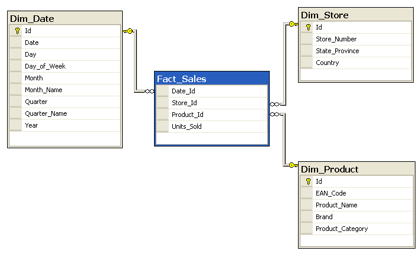

[](https://ci.appveyor.com/project/antoinebidault/dataquery-net)


# DataQuery.Net

The data query is an ASP.Net library for querying dynamically huge database using a basic querying language similar to Google analytics's API Explorer querying language (dimensions, metrics, filters...) .
This tool was particularly useful for building a custom analytic tools on a bug database using millions of lines. If you need to do lots of dynamics queries, time series, pie charts, this library can be particularly useful.

# Disclaimer

Use it at your own risk, this library is still WIP and needs some refactoring and testing improvements.

# Prerequisite

You need an SQL database on SQL Server 2012+
ASP.Net 3+
You'll need an sql database structured as a star :
[https://en.wikipedia.org/wiki/Star_schema](https://en.wikipedia.org/wiki/Star_schema)


# Quickstart guide

Install nuget package

```
package-install DataQuery.Net
```

Sample configuration in Startup.cs ConfigureServices() method :

```CSharp
services.AddDataQuery(options => {
    options.ConnectionString = "{your SQL Server connection string here}";
});

// Register your provider as singleton or whatever. In order to make it dynamic if necessary
services.AddSingleton<MyAwesomeDataQueryProvider>();
services.AddDataQueryProvider<MyAwesomeDataQueryProvider>();
```

Implement the IDataQueryProvider interface to provide the metrics and dimensions lists to query :

```CSharp

  public class MyAwesomeDataQueryProvider : IDataQueryProvider
  {
    public DataQueryCollections Provide()
    {
      var cnx = "Ma chaine de connexion à la BDD ici";
      var config = new DataQueryCollections() { };

      var table = config.AddTable( new Table("User")
      {
        // The table name, it must match the key name
        Name = "User",
        // The AS alias "select from table AS {alias}"
        Alias = "U"
      });

      table.AddDimension(new Column()
          {
	          // Name : The unique name of the dim or metric
            Name = "UserId",
	          // If it's a metric, you must use the proper aggregation operator : e.g. SUM(), AVG(), COUNT()...
            // <table> will be automatically replaced by the table alias
            SqlName = "<table>.Id",
	          // Field description
            Description = "User's id",
            Label="Userid",
            // Le type SQL du champ sera utile pour parser les dimensions sélectionnés.
            SqlType = SqlDbType.Int,
            // Set as visible or no
            Displayed = true,
            // True if it's a metric
            IsMetric = false,
            // SQL join. The key is the "Name" of the target table, the value is the name of the prop (IN SQL, do not take the alias).
            // The sql join must be done in the both side. In this use case, in "User_Stat" => to User.id and "User" => to User_State.UserId.
            SqlJoins = new Dictionary<string, string>
            {
              {"User_Stat", "UserId" }
            }
          });

          table.AddDimension(new Dimension()
          {
            Name = "Name",
            SqlName = "<table>.Name",
            Description = "User's name",
            Label="Username",
            Displayed = true
          });

          table.AddDimension(new Dimension()
          {
            Alias = "Email",
            Name = "<table>.Email",
            Description = "Email",
            Label="Email",
            Displayed = true
          });
          ,


      var userStatTable = config.AddTable(new Table("User_Stat")
      {
        Name = "User_Stat",
        Alias = "US"
      });


      userStatTable.AddDimension(
          new Dimension()
          {
            Name = "UserRef",
            SqlName = "<table>.UserId", // Table will be replaced by the table alias dynamically
            Displayed = true,
            SqlJoins = new Dictionary<string, string>
            {
              {"User", "UserId" }
            }
          }
      );

       userStatTable.AddDimension(
          new Dimension()
          {
            Name = "Date",
            SqlName = "<table>.Date",
            Description = "Date",
            SqlType = System.Data.SqlDbType.Date,
            Displayed = true
          }
      );


       userStatTable.AddMetric(
           new Metric()
          {
            Alias = "NbConnexion",
            ColumnName = "SUM(<table>.NbConnexion)",
            Description = "NbConnexion",
            Label="NbConnexion",
            Displayed = true
          }
      );

      return config;
    }
  }
```

In this sample, we have configured two tables :

- User: Name, Email, UserId
- User_Stat: Date, NbConnexion, UserRef

**Important note**
The metric's alias must be unique, because it will be used for querying data

# Query caching

By default, caching of query result is available

## Enable standard caching as following

Youc an enable distributed caching as following

```CSharp
services.AddDataQuery(options => {
    options.CacheEnabled = true;
    options.CacheDuration = 100; // Cache duration in seconds
});
```

## Support of Distributed caching

You can enable distributed caching service like Redis as following (IDistributedCache must be properly setup in your app)

```CSharp
services.AddDataQuery(options => {
    options.DestributedCache = true;
    options.CacheEnabled = true;
});
```

# Querying the data

For executing the data in a sample webapp :

```CSharp

public TestController : Controller
{
  public IDataQuery _dataQuery;
	public TestController(IDataQuery dataQuery){
		_dataQuery = dataQuery;
	}

	[HttpGet]
	public IActionResult GetStats(DataQueryFilterParam params){
	    var results =	_dataQuery.Query(params);
		return Ok(results);
	}

}

```

Here is a sample query to get the nb connexions per date for Jean-Marc :

```CSharp
/Test?dimensions=Date&metrics=NbConnexion&asc=false&sort=Date&filters=Name%3DJean-Marc
```

# Query params list

- aggregate : wether the data are grouped or not
- size : size of the recordset (paginated results)
- page : page index
- query: full text query (using FullText index)
- queryConstraint : for limiting field used in full text query.
- sort : name of the metric or dimension used to sort data
- dimensions : comma separated dimensions to select, ex: UserName, Email
- metrics : list of metrics to query, ex: NbConnexions
- filters : filter used, ex: (Name==Toto,Name!=Titi);NbViews>12;Date>01/01/2020
  , = OR / ; = AND / == = equal / != = different / =~ = LIKE (with a % on the value)
